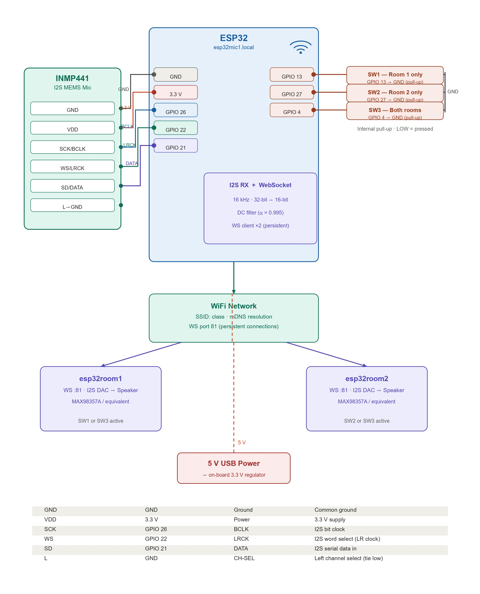
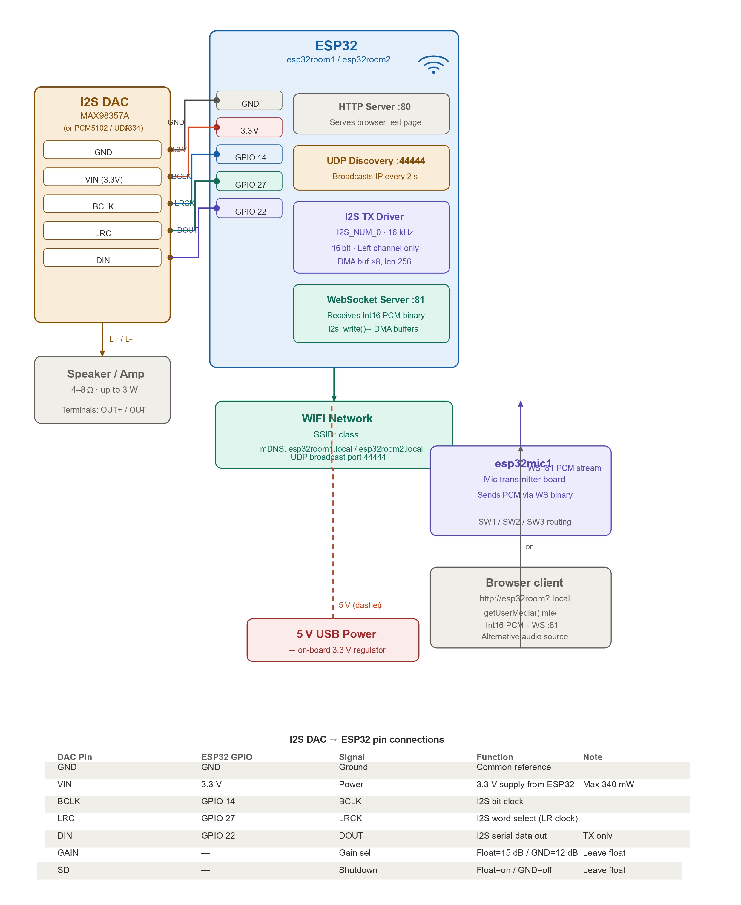

# Wireless Audio Notice Board System

## Objective

The **Wireless Audio Notice Board System** is an IoT-based real-time wireless public announcement system developed using **ESP32 microcontrollers** and a **Flutter mobile application**. The system eliminates the need for traditional wired public address systems by enabling live voice announcements over a Wi-Fi network.

Voice announcements can be transmitted using either an **INMP441 I2S MEMS microphone** connected to an ESP32 transmitter or directly from a **Flutter mobile application**. The audio is streamed wirelessly using the **UDP protocol** and reproduced through ESP32 receiver units connected to **MAX98357A I2S audio amplifiers** and speakers.

---

## Skills Learned

* Embedded Systems Development
* ESP32 Programming
* Flutter Mobile Application Development
* Wi-Fi Communication
* UDP Audio Streaming
* I2S Digital Audio Interface
* Embedded C/C++
* IoT System Design
* Hardware Integration
* Real-Time Audio Processing
* Wireless Communication
* System Testing & Debugging

---

## Tools Used

* ESP32 DevKit V1
* Flutter
* Arduino IDE
* Embedded C/C++
* INMP441 I2S MEMS Microphone
* MAX98357A I2S Audio Amplifier
* Wi-Fi Router
* UDP Protocol
* I2S Communication Protocol

---

# Steps

Below are the key implementation stages of the Wireless Audio Notice Board System.

---

## 1. System Architecture Design

The project architecture consists of an ESP32 transmitter, Wi-Fi communication network, ESP32 receiver, audio amplifier, and speaker. The system supports voice announcements from both an INMP441 microphone and a Flutter mobile application.

**Ref 1: System Architecture**

---

## 2. Audio Capture

Voice announcements can be captured using either:

* INMP441 Digital MEMS Microphone connected to ESP32
* Flutter Mobile Application acting as a wireless microphone

The ESP32 processes digital audio through the I2S interface before transmitting it over the network.

**Ref 2: Audio Capture Workflow**

---

## 3. Wireless Audio Transmission

The processed audio packets are transmitted wirelessly over the local Wi-Fi network using the UDP protocol, ensuring low-latency communication.

**Ref 3: Wireless Audio Transmission**

---

## 4. Audio Playback

The receiver ESP32 reconstructs the received audio packets and sends them to the MAX98357A I2S amplifier, which drives the speaker for real-time playback.

**Ref 4: Audio Output Workflow**

---

## 5. ESP32 Transmitter

The transmitter module captures voice input from the INMP441 microphone, processes it, and streams the audio wirelessly.

**Ref 5: ESP32 Transmitter**

---

## 6. ESP32 Receiver

The receiver module listens for incoming UDP packets, reconstructs the audio stream, and outputs the audio through the amplifier and speaker.

**Ref 6: ESP32 Receiver**

---

## 7. Flutter Mobile Application

A Flutter application was developed to function as a wireless microphone, allowing users to broadcast announcements directly from their smartphones.

### Features

* Live Voice Streaming
* Push-to-Talk
* Low-Latency Audio
* Wi-Fi Connectivity
* User-Friendly Interface

> **Replace the image below with a screenshot of your Flutter application.**

---

## Future Enhancements

* Multi-room Broadcasting
* Zone-Based Announcements
* Audio Recording
* Announcement Scheduling
* Secure Encrypted Streaming
* Cloud Connectivity
* AI Noise Suppression
* Mesh Networking Support

---

## Applications

* Schools and Colleges
* Offices
* Hospitals
* Factories
* Shopping Malls
* Railway Stations
* Airports
* Smart Buildings
* Government Institutions

---

## Project Highlights

* Real-time Wireless Audio Streaming
* Dual Audio Input (Flutter + INMP441 Microphone)
* ESP32-Based Embedded System
* Low-Latency UDP Communication
* I2S Digital Audio Processing
* Mobile-Controlled Announcements
* Cost-Effective and Scalable Architecture
